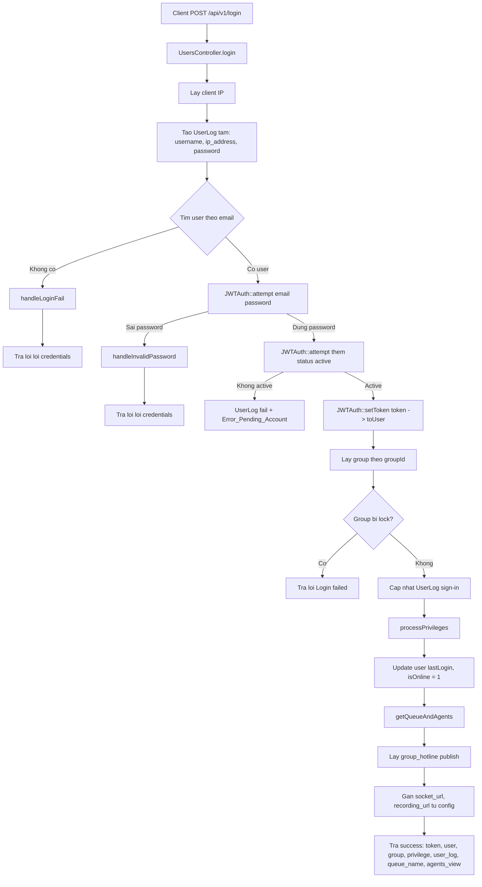

# POST /api/v1/login

Controller: `UsersController@login(Request $request)`

## Input Chính

```json
{
  "email": "superadmin@mipbx.vn",
  "password": "Mitek123#$",
  "remember_token": true
}
```

## Flow



## Output Thành Công

```json
{
  "success": {
    "token": "...",
    "user": {},
    "group": {},
    "group_hotline": [],
    "privilege": [],
    "user_log": {},
    "queue_name": {},
    "agents_view": {}
  }
}
```

## Ghi Chú

- Route login không nằm trong `jwt.auth`.
- Login ghi `users_log`.
- Nếu `remember_token` có giá trị, token được set hạn dài hơn bằng custom claim `exp`.
