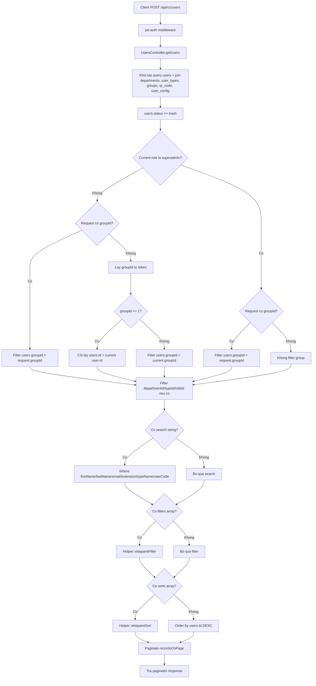

# POST /api/v1/users

Controller: `UsersController@getUsers(Request $request)`

Middleware: `api`, `jwt.auth`

## Input Ví Dụ

```json
{
  "groupId": 1,
  "departmentId": 2,
  "typeId": 1,
  "roleId": "agent",
  "search": "test",
  "recordsOnPage": 10,
  "current_page": 1,
  "filters": [],
  "sorts": []
}
```

## Flow



## Output

Laravel trả trực tiếp paginator object của Eloquent.

## Ghi Chú

- Non-superadmin bị giới hạn dữ liệu theo `groupId` hoặc chính user hiện tại nếu `groupId == 1`.
- Có nguy cơ SQL injection ở đoạn `search` vì dùng `whereRaw` nối trực tiếp `$txt`.
