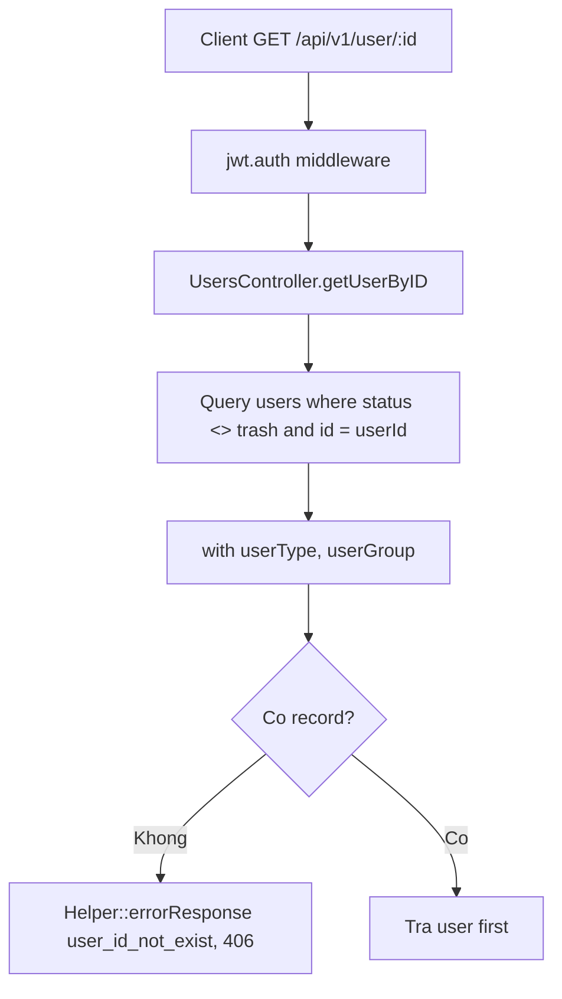

# GET /api/v1/user/{id}

Controller: `UsersController@getUserByID($userId)`

Middleware: `api`, `jwt.auth`

## Flow



## Output Thành Công

```json
{
  "id": 1,
  "email": "superadmin@mipbx.vn",
  "userType": {},
  "userGroup": {}
}
```

## Ghi Chú

- Method không check user hiện tại có quyền xem `userId` này hay không.
- Chỉ loại `status = trash`.
