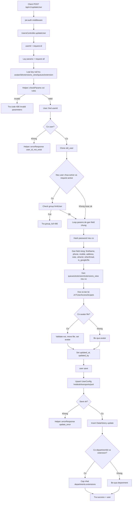

# POST /api/v1/updateUser

Controller: `UsersController@updateUser(Request $request)`

Middleware: `api`, `jwt.auth`

## Input Ví Dụ

```json
{
  "id": 1,
  "firstName": "Test",
  "lastName": "User",
  "email": "test@example.com",
  "phone": "011111111111",
  "groupId": 1,
  "status": "active",
  "role": "agent",
  "extension": "1001"
}
```

## Flow



## Output Thành Công

```json
{
  "success": true,
  "user": {}
}
```

## Ghi Chú

- Laravel không check quyền sửa user khác trong method này. Chỉ cần qua `jwt.auth`.
- Nếu request không gửi một số field, code Laravel vẫn set một vài field về rỗng/null như `firstName`, `phone`, `mobile`, `address`, `note`.
- Scope `region/branch/department` bị xóa và tạo lại theo request.
