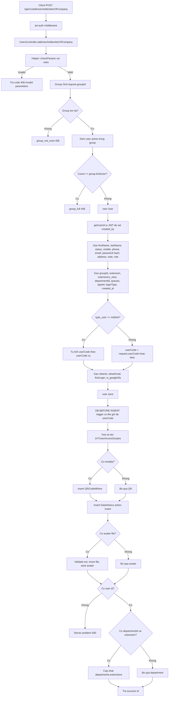

# POST /api/v1/addUserAsMemberOfCompany

Controller: `UsersController@addUserAsMemberOfCompany(Request $request)`

Middleware: `api`, `jwt.auth`

## Input Ví Dụ

```json
{
  "firstName": "Test",
  "lastName": "User",
  "email": "test@example.com",
  "password": "Mitek123#$",
  "confirmPassword": "Mitek123#$",
  "groupId": 1,
  "status": "active",
  "role": "agent",
  "extension": "1001",
  "typeId": 1
}
```

## Flow



## Output Thành Công

```json
{
  "success": {
    "id": 123
  }
}
```

## Ghi Chú

- `id` do MySQL `AUTO_INCREMENT` cấp, không đảm bảo liên tục.
- `userCode` trong PHP có thể bị DB trigger `BEFORE INSERT users` ghi đè.
- DB có unique key `(userCode, groupId)`, nên nếu trigger sinh trùng mã sẽ lỗi `Duplicate entry`.
- Method không dùng transaction, nên nếu lỗi sau `user->save()`, các bước trước đó có thể đã ghi DB.
