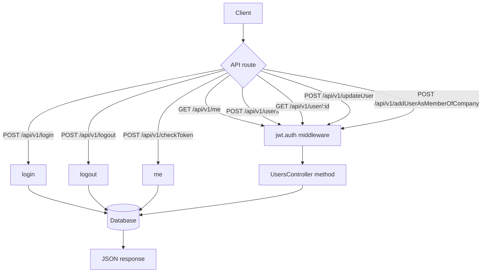

# UsersController API Flow

Folder này mô tả flow chạy của các API chính trong `UsersController`.

Nguồn đối chiếu:

- Route: `routes/api.php`
- Controller: `app/Http/Controllers/Managers/UsersController.php`
- Base path Laravel: `/api/v1`

## Route Map

| Method | Path | Controller method | Middleware |
| --- | --- | --- | --- |
| POST | `/api/v1/login` | `UsersController@login` | none |
| POST | `/api/v1/logout` | `UsersController@logout` | none theo route hiện tại |
| GET | `/api/v1/me` | `UsersController@me` | `api`, `jwt.auth` |
| POST | `/api/v1/checkToken` | `UsersController@me` | none theo route hiện tại |
| POST | `/api/v1/users` | `UsersController@getUsers` | `api`, `jwt.auth` |
| GET | `/api/v1/user/{id}` | `UsersController@getUserByID` | `api`, `jwt.auth` |
| POST | `/api/v1/updateUser` | `UsersController@updateUser` | `api`, `jwt.auth` |
| POST | `/api/v1/addUserAsMemberOfCompany` | `UsersController@addUserAsMemberOfCompany` | `api`, `jwt.auth` |

## Files

- `01-login.md`: flow đăng nhập.
- `02-logout.md`: flow đăng xuất.
- `03-me-check-token.md`: flow `/me` và `/checkToken`.
- `04-users-list.md`: flow lấy danh sách users.
- `05-get-user-by-id.md`: flow lấy user theo id.
- `06-update-user.md`: flow cập nhật user.
- `07-add-user-as-member.md`: flow tạo user trong company/group.

## Tổng Quan

## Lưu Ý Quan Trọng

- `/api/v1/checkToken` trong `routes/api.php` đang trỏ vào `me()`, không gọi method `checkToken(Request $request)` đang nằm trong controller.
- `updateUser()` chỉ yêu cầu token hợp lệ qua `jwt.auth`; code Laravel hiện tại không chặn token user A sửa `id` của user B.
- `addUserAsMemberOfCompany()` không tự set `id`; `id` do MySQL `AUTO_INCREMENT` cấp.
- DB hiện có trigger `BEFORE INSERT users` có thể ghi đè `userCode` bằng `getLastestUserCode_v2(groupId)`.
