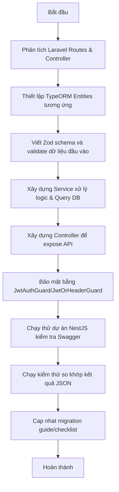

# Luồng làm việc Migration từng Module (Agent Workflow)

Dưới đây là luồng làm việc chuẩn (Standard Workflow) khi tiến hành di chuyển một module bất kỳ từ Laravel sang NestJS:

## Chi tiết các bước thực hiện:

### Bước 1: Phân tích mã nguồn Laravel gốc
- Mở file `routes/api.php` tìm các route thuộc module cần làm.
- Xác định Controller và phương thức xử lý (ví dụ: `UsersController@getUserLogs`).
- Đọc code controller đó để nắm được:
  - Tham số đầu vào nào là bắt buộc/tự chọn.
  - Các bảng dữ liệu nào tham gia truy vấn.
  - Logic nghiệp vụ (bắt lỗi, mã hoá, tính toán).

### Bước 2: Thiết lập Entities
- Khai báo Entity tương ứng với bảng đích trong thư mục `entities/` của module.
- Sử dụng đúng decorator của TypeORM (`@Entity`, `@PrimaryGeneratedColumn`, `@Column`).
- Không dùng `class-transformer` cho entity mới. Trường nhạy cảm như `password`,
  `remember_token`, JWT secret và DB secret phải được loại bỏ rõ ràng ở mapper/serializer
  trước khi trả về client.

### Bước 3: Thiết lập Zod schema
- Tạo schema trong thư mục `schemas/` của module để nhận request payload.
- Dùng `ZodValidationPipe` tại controller route cần validate.
- Message validate mới phải là tiếng Việt có dấu và trả lỗi theo chuẩn NestJS.

### Bước 4: Viết Service & Controller
- Tạo Service chứa logic nghiệp vụ và truy vấn DB. Inject đúng Repository hoặc Database Connection.
- Tạo Controller định nghĩa API route, chỉ định Zod schema đầu vào, gán Guard bảo mật (`@UseGuards(JwtAuthGuard)`).

### Bước 5: Chạy thử và Đối chiếu
- Khởi chạy NestJS bằng `npm run start:dev`.
- Truy cập Swagger API (`http://localhost:3000/api-docs`) để kiểm nghiệm cấu trúc API.
- Dùng Postman gọi thử cả 2 API Laravel và NestJS để so sánh kết quả trả về.

### Buoc 6: Cap nhat tai lieu bat buoc
- Sau moi lan sua code, config, guard, Swagger, auth behavior, DB side effect, hoac response shape, phai cap nhat file migration guide lien quan truoc khi ket thuc luot.
- Neu sua Auth/User, cap nhat `8_AUTH_USER_CHECKLIST.md`.
- Neu sua scope full API, blocker, module chung, env/config, guard, Swagger hoac milestone, cap nhat `9_FULL_API_MIGRATION_PLAN.md`.
- Neu them/sua quy tac lam viec, cap nhat `2_RULES.md` va file workflow nay.
- Khong mark `DONE` neu chua co Postman parity; dung `CODED_PENDING_POSTMAN` cho code da port nhung chua doi chieu Laravel.

---

## 6. Câu hỏi Ôn tập & Tự đánh giá (Workflow Review Questions)
1. **Phân tích code cũ**: Khi chuyển đổi một hàm Controller từ Laravel, những thành phần logic nào (Middleware, Custom Request, Eloquent Query, Response Formatting) bạn cần thu thập và chuyển dịch tương đương trong NestJS?
2. **Zod & Validation**: Hãy giải thích tại sao việc viết Zod schema rõ ràng tốt hơn việc nhận body bằng `Record<string, unknown>` rồi tự validate rải rác trong service.
3. **Data Serialization**: Làm thế nào để đảm bảo các trường nhạy cảm như `password` không bao giờ bị trả về client trong NestJS khi không còn dùng `class-transformer`?
4. **Đối chiếu kết quả**: Khi kiểm thử API NestJS với API Laravel gốc bằng Postman, những tiêu chí nghiệp vụ và side effect DB nào cần được so sánh, khi response shape không còn bắt buộc giống Laravel 100%?
