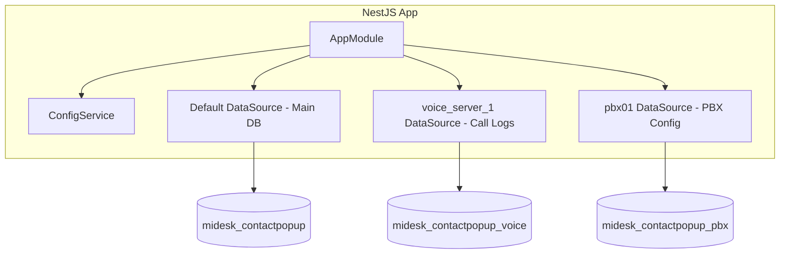

# Thiết kế Kiến trúc Hệ thống NestJS (Architecture)

## 0. Cập nhật kiến trúc từ 2026-05-27

- Data access mới dùng TypeORM repository/entity, không viết thêm raw `mysql2`
  trong endpoint mới/refactor. `DatabaseService` hiện chỉ là bridge cho phần legacy.
- Validation request mới dùng Zod schema qua `ZodValidationPipe`; không tạo thêm
  DTO `class-validator` cho phần mới.
- Response/error mới theo chuẩn NestJS. Laravel chỉ dùng để đối chiếu nghiệp vụ
  đúng/sai và side effect DB, không còn khóa response shape 100%.
- Entity được đặt theo module, ví dụ `src/modules/users/entities/*.entity.ts`,
  thay vì gom toàn bộ vào một thư mục root.

Kiến trúc hệ thống được xây dựng nhằm đảm bảo tính module hóa cao, dễ mở rộng và tương thích tối đa với mô hình cơ sở dữ liệu hiện tại của dự án Laravel.

## 1. Thiết kế Đa cơ sở dữ liệu (Multi-Database Design)

NestJS sử dụng TypeORM kết nối đồng thời 3 cơ sở dữ liệu MySQL bằng cách định nghĩa các DataSource có định danh (name) riêng biệt:



- **Default Database**:
  - Quản lý các bảng Core: `users`, `groups`, `customers`, `user_types`, `departments`, `field_customs`, `user_privileges`.
  - Thực thể được lưu tại: `src/entities/*.entity.ts`.
- **Voice Server Database**:
  - Quản lý các bảng lịch sử cuộc gọi: `cdr`, `cdr_monthly`, `queue_log`, `queue_agent_action`.
  - Thực thể được lưu tại: `src/entities/voice/*.entity.ts`.
  - Sử dụng connection name: `'voice_server_1'`.
- **PBX Database**:
  - Quản lý cấu hình tổng đài: `cluster_pbx`, `extension_mapping`, `user_access_scopes`.
  - Thực thể được lưu tại: `src/entities/pbx/*.entity.ts`.
  - Sử dụng connection name: `'pbx01'`.

---

## 2. Luồng bảo mật và Phân quyền (Security & Guards)

NestJS cung cấp các Guards kế thừa Passport JWT Strategy để quản lý phiên đăng nhập:

### A. JwtAuthGuard (Xác thực bắt buộc)
- Áp dụng cho phần lớn các route quản lý trong hệ thống.
- Trích xuất token từ header `Authorization: Bearer <token>`.
- Đối chiếu chữ ký bằng `JWT_SECRET`. Nếu thành công, tiêm đối tượng `user` đã giải mã vào trong `request.user`.

### B. JwtOrHeaderGuard (Xác thực linh hoạt)
- Áp dụng riêng cho các route API Connector (`/connector/*`).
- Cho phép truy cập nếu:
  1. Header `Authorization` chứa token JWT hợp lệ.
  2. HOẶC Header `X-Custom-Token` khớp với token bí mật `CONNECTOR_TOKEN` được lưu trong file cấu hình `.env`.
  3. HOẶC bypass trực tiếp nếu biến môi trường `CONNECTOR_ALLOW_UNAUTHENTICATED` được set là `true` (dành cho chế độ local development).

---

## 3. Cấu trúc Thư mục Phân tầng (Layered Structure Layout)

Dự án sử dụng cấu trúc phân tầng cấp dự án (Layer-Based) thay vì gom cụm theo module nhỏ:
```text
src/
├── controllers/          # Lớp định tuyến API (Controllers)
│   ├── auth.controller.ts
│   ├── users.controller.ts
│   └── ...
├── services/             # Lớp nghiệp vụ (Services)
│   ├── auth.service.ts
│   ├── users.service.ts
│   └── ...
├── entities/             # Lớp mô hình dữ liệu (TypeORM Entities)
│   ├── user.entity.ts
│   ├── voice/
│   │   └── cdr.entity.ts
│   └── pbx/
│       └── cluster-pbx.entity.ts
├── dtos/                 # Lớp Validate đầu vào (DTOs)
├── modules/              # Đăng ký Module DI để liên kết Controller & Service
│   ├── auth.module.ts
│   ├── users.module.ts
│   └── ...
```

---

## 4. Câu hỏi Ôn tập & Tự đánh giá (Architecture Review Questions)
1. **Multi-Database Configuration**: Trong cấu trúc layered mới, làm thế nào để TypeORM tự động phân biệt được Entity nào thuộc về kết nối Default DB, Entity nào thuộc về kết nối Voice DB? (Gợi ý: Cấu hình quét trường `entities` trong case tương ứng ở `database.config.ts`).
2. **NestJS Guard vs Express Middleware**: So sánh sự khác nhau về vị trí thực thi và ưu điểm của `JwtAuthGuard` trong NestJS so với route middleware `jwt.auth` của Laravel.
3. **Module Registration**: Khi sử dụng cấu trúc Layered (Controllers và Services tách biệt ở root), tại sao chúng ta vẫn cần các tệp như `users.module.ts`? Tệp này đóng vai trò gì trong cơ chế Dependency Injection của NestJS?
4. **Custom Guard Fallback**: Đoạn code kiểm tra xác thực của `JwtOrHeaderGuard` xử lý các bước rẽ nhánh như thế nào khi một request gọi vào không cung cấp JWT token nhưng có header `X-Custom-Token`? Cần cấu hình gì trong file `.env` để bypass chế độ này lúc phát triển ở local?
